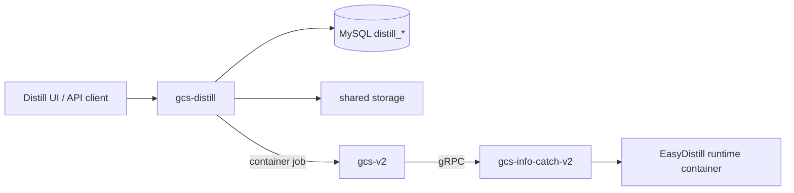

<p align="center">
  
</p>

<h1 align="center">GCS-Distill</h1>

<p align="center">
  GCS 系列的蒸馏编排服务：管理项目、数据集、流水线、EasyDistill 配置、共享存储清单和阶段状态。
</p>

<p align="center">
  <a href="https://go.dev/"></a>
  <a href="https://github.com/ReyRen/gcs-distill"></a>
  
  
</p>

## 项目定位

`gcs-distill` 是蒸馏控制面。它负责业务对象、流水线阶段、运行目录、EasyDistill 配置和产物清单；实际容器资源调度与 Docker 执行统一交给 [`gcs-v2`](https://github.com/ReyRen/gcs-v2) 与 [`gcs-info-catch-v2`](https://github.com/ReyRen/gcs-info-catch-v2)。

它不直接操作 Docker，不维护 GPU/NPU 调度状态，也不内置独立数据库服务。阶段容器通过 `POST /api/v1/tasks/container` 提交给 `gcs-v2`。

## GCS 系列关系

| 仓库 | 角色 | 与 `gcs-distill` 的关系 |
| --- | --- | --- |
| [`gcs-distill`](https://github.com/ReyRen/gcs-distill) | 蒸馏编排控制面 | 当前仓库，负责项目、数据集、流水线和 EasyDistill 配置 |
| [`gcs-v2`](https://github.com/ReyRen/gcs-v2) | 集群调度控制面 | 接收 distill 阶段容器任务，统一调度 XPU 和节点 |
| [`gcs-info-catch-v2`](https://github.com/ReyRen/gcs-info-catch-v2) | Worker 执行代理 | 由 `gcs-v2` 间接调用，负责真正运行 EasyDistill 容器 |
| [`gcs-model-center-v2`](https://github.com/ReyRen/gcs-model-center-v2) | 模型服务控制面 | 可复用同一个 `ai_market` MySQL 实例，表前缀隔离 |
| [`gcs-infer-center`](https://github.com/ReyRen/gcs-infer-center) | 推理应用门户 | 可作为上层应用入口，消费模型与推理服务能力 |



## 核心能力

| 能力 | 说明 |
| --- | --- |
| 项目管理 | 保存教师模型、学生模型、目标任务、蒸馏参数和项目元数据 |
| 数据集管理 | 支持数据集创建、上传、记录数统计、更新和删除 |
| 流水线编排 | 维护蒸馏流水线运行、阶段状态、取消、日志查询和日志流 |
| 配置生成 | 为 EasyDistill 阶段生成 `teacher_infer.json`、`student_train.json`、`evaluate.json` |
| 共享存储 | 统一管理 configs、data、eval、logs、models/checkpoints 等运行目录 |
| GCS 集成 | 使用 `gcs-v2` 通用容器任务执行 EasyDistill 阶段容器 |
| OpenAPI | 构建时自动校验并格式化内嵌 OpenAPI 文档 |

## 流水线阶段

| 阶段 | 说明 | 执行方式 |
| --- | --- | --- |
| `teacher_config` | 校验教师模型配置 | 本服务内执行 |
| `dataset_build` | 创建运行目录，生成种子数据清单 | 本服务内执行 |
| `teacher_infer` | 生成教师推理配置并提交容器 | `gcs-v2` container job |
| `data_govern` | 过滤、去重并拆分训练/测试数据 | 本服务内执行 |
| `student_train` | 生成学生训练配置并提交容器 | `gcs-v2` container job |
| `evaluate` | 生成评估配置，提交容器并解析结果 | `gcs-v2` container job |

运行目录约定：

```text
{executor.workspace_root}/projects/{project_id}/runs/{pipeline_id}/
├── configs/
├── data/
│   ├── seed/
│   ├── generated/
│   └── filtered/
├── eval/
├── logs/
└── models/
    └── checkpoints/
```

共享存储必须在所有 `gcs-v2` 执行节点上以同一路径可访问，否则容器内配置路径会失效。

## API 速览

统一前缀：`/api/v1`

| 场景 | 接口 |
| --- | --- |
| 健康与文档 | `GET /health`, `GET /swagger/index.html`, `GET /swagger/openapi.json` |
| 项目 | `POST /projects`, `GET /projects`, `GET /projects/{id}`, `PUT /projects/{id}`, `DELETE /projects/{id}` |
| 数据集 | `POST /projects/{id}/datasets`, `POST /datasets`, `GET /datasets`, `GET /datasets/{id}`, `PUT /datasets/{id}`, `DELETE /datasets/{id}` |
| 流水线 | `POST /pipelines`, `GET /pipelines`, `GET /pipelines/{id}`, `POST /pipelines/{id}/start`, `POST /pipelines/{id}/cancel` |
| 阶段与日志 | `GET /pipelines/{id}/stages`, `GET /pipelines/{id}/stages/{stage_id}/logs`, `GET /pipelines/{id}/stages/{stage_id}/logs/stream`, `GET /pipelines/{id}/stages/{stage_id}/logs/download` |
| 模型与资源 | `GET /models/student`, `GET /models/student/{id}`, `GET /resources/nodes`, `GET /resources/nodes/{name}` |

API 文档入口：

| 类型 | 地址 |
| --- | --- |
| Swagger UI | `http://<distill.host>:8080/swagger/index.html` |
| OpenAPI JSON | `http://<distill.host>:8080/swagger/openapi.json` |

## 快速启动

前置依赖：

- Go 1.25+
- MySQL 8.0+，可复用 `gcs-model-center-v2` 的 `ai_market`
- 已运行且可访问的 `gcs-v2`
- 已接入 `gcs-v2` 的 `gcs-info-catch-v2`
- 多节点共享存储路径一致

```bash
make build
make test
make run-server
```

systemd 部署方式与 `gcs-v2` 保持一致：

```bash
make deploy
make status-service
make logs-service
```

`make deploy` 会按顺序执行：

```text
swagger -> server build -> install systemd unit -> enable service -> restart service
```

默认服务文件假设仓库位于 `/root/go/src/gcs-distill`，服务启动命令为：

```text
/root/go/src/gcs-distill/bin/gcs-distill-server --config /root/go/src/gcs-distill/config.toml
```

默认配置会尽量复用 `gcs-model-center-v2` 的统一服务：MySQL 使用同一个 `ai_market`，GCS 地址指向同一个 `gcs-v2`，共享存储位于 `/storage-root-jfs/distill`。如果生产环境不希望在 `config.toml` 直接写数据库密码，可以清空 `database.password`，设置 `database.password_env = "AI_MARKET_DB_PASSWORD"`，并创建 `/etc/gcs-distill/gcs-distill.env`：

```bash
AI_MARKET_DB_PASSWORD=your-password
```

EasyDistill runtime 镜像不在本仓库构建，Dockerfile 应放在 EasyDistill 或专门的镜像发布仓库。`executor.runtime_image` 只是提交给 `gcs-v2` 的镜像引用；镜像应提前构建并推送到 worker 节点可拉取的 registry。执行时链路为：

```text
gcs-distill config/runtime_image -> gcs-v2 container job -> gcs-info-catch-v2 docker pull/run
```

## 配置边界

关键配置集中在 `config.toml`：

| 配置段 | 作用 |
| --- | --- |
| `[server]` | HTTP 服务监听和运行模式 |
| `[database]` | MySQL 连接、连接池和密码注入；默认复用 model-center 的 `ai_market` |
| `[storage]` | distill 共享存储与模型目录 |
| `[gcs]` | `gcs-v2` REST API 地址和超时；默认与 model-center 指向同一套 GCS |
| `[logging]` | 日志级别、输出和轮转 |
| `[executor]` | 工作目录、并发度和 EasyDistill runtime 镜像 |

除 distill 自己的工作目录、日志和 EasyDistill runtime 镜像外，数据库、GCS 等统一服务配置应优先参考 `gcs-model-center-v2`，避免同一套 GCS 系统出现多份互相漂移的服务地址。

## 代码结构

```text
cmd/openapi/          OpenAPI 校验与格式化
cmd/server/           HTTP 服务入口
internal/client/gcs/  调用 gcs-v2 的 HTTP client
internal/config/      TOML 配置解析
internal/types/       业务领域类型
repository/mysql/     MySQL repository
runtime/              EasyDistill 配置生成与运行清单
server/               Gin 路由、handler、middleware、内嵌 Swagger
service/              项目、数据集、流水线与执行队列
```

## 维护原则

- 蒸馏业务状态只在 `gcs-distill` 维护，容器状态只通过 `gcs-v2` 对账。
- 上游准备共享存储目录和 EasyDistill 配置，下游只消费确定路径。
- `distill_*` 表和 `mc_*` 表可以共享数据库，但不能共享业务表。
- 构建产物、运行日志、临时目录和本地覆盖配置不进入仓库。
