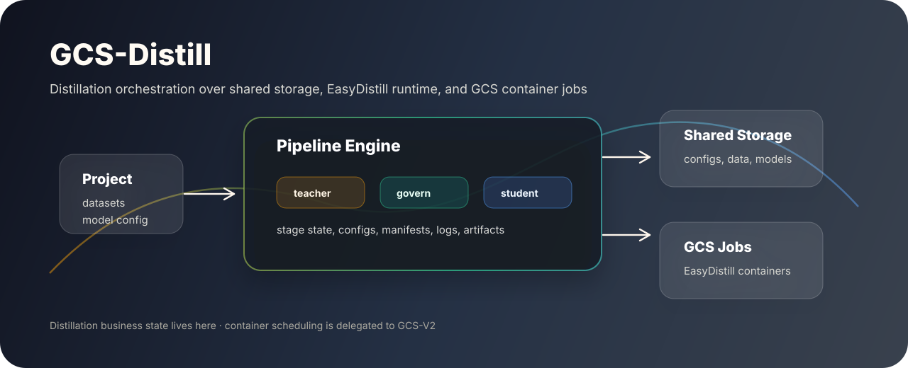
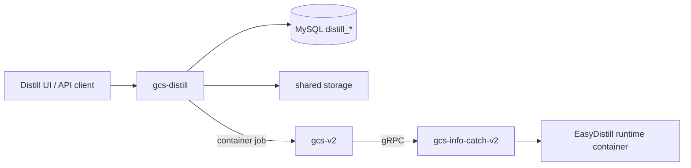

<p align="center">
  
</p>

<h1 align="center">GCS-Distill</h1>

<p align="center">
  GCS 系列的蒸馏编排服务：管理项目、数据集、流水线、EasyDistill 配置、共享存储清单和阶段状态。
</p>

<p align="center">
  <a href="https://go.dev/"></a>
  <a href="https://github.com/ReyRen/gcs-distill"></a>
  
  
</p>

## 项目定位

`gcs-distill` 是蒸馏控制面。它负责业务对象、流水线阶段、运行目录、EasyDistill 配置和产物清单；实际容器资源调度与 Docker 执行统一交给 [`gcs-v2`](https://github.com/ReyRen/gcs-v2) 与 [`gcs-info-catch-v2`](https://github.com/ReyRen/gcs-info-catch-v2)。

它不直接操作 Docker，不维护 GPU/NPU 调度状态，也不内置独立数据库服务。阶段容器通过 `POST /api/v1/tasks/container` 提交给 `gcs-v2`。

## GCS 系列关系

| 仓库 | 角色 | 与 `gcs-distill` 的关系 |
| --- | --- | --- |
| [`gcs-distill`](https://github.com/ReyRen/gcs-distill) | 蒸馏编排控制面 | 当前仓库，负责项目、数据集、流水线和 EasyDistill 配置 |
| [`gcs-v2`](https://github.com/ReyRen/gcs-v2) | 集群调度控制面 | 接收 distill 阶段容器任务，统一调度 XPU 和节点 |
| [`gcs-info-catch-v2`](https://github.com/ReyRen/gcs-info-catch-v2) | Worker 执行代理 | 由 `gcs-v2` 间接调用，负责真正运行 EasyDistill 容器 |
| [`gcs-model-center-v2`](https://github.com/ReyRen/gcs-model-center-v2) | 模型服务控制面 | 可复用同一个 `ai_market` MySQL 实例，表前缀隔离 |
| [`gcs-infer-center`](https://github.com/ReyRen/gcs-infer-center) | 推理应用门户 | 可作为上层应用入口，消费模型与推理服务能力 |



## 核心能力

| 能力 | 说明 |
| --- | --- |
| 项目管理 | 保存教师模型、学生模型、目标任务、蒸馏参数和项目元数据 |
| 数据集管理 | 从 `/storage-root-jfs/user-{uid}/train-center/model-distill/datasets/candidates` 扫描可选数据集，支持上传、登记、记录数统计、更新和删除 |
| 流水线编排 | 维护蒸馏流水线运行、阶段状态、取消、日志 tail 和 WebSocket 实时日志 |
| 配置生成 | 为 EasyDistill 阶段生成 `teacher_infer.json`、`student_train.json`、`evaluate.json` |
| 共享存储 | 统一管理 configs、data、eval、logs、models/checkpoints 等运行目录 |
| GCS 集成 | 使用 `gcs-v2` 通用容器任务执行 EasyDistill 阶段容器 |
| OpenAPI | 构建时自动校验并格式化内嵌 OpenAPI 文档 |

## 流水线阶段

| 阶段 | 说明 | 执行方式 |
| --- | --- | --- |
| `teacher_config` | 校验教师模型配置 | 本服务内执行 |
| `dataset_build` | 创建运行目录，生成种子数据清单 | 本服务内执行 |
| `teacher_infer` | 生成教师推理配置并提交容器 | `gcs-v2` container job |
| `data_govern` | 过滤、去重并拆分训练/测试数据 | 本服务内执行 |
| `student_train` | 生成学生训练配置并提交容器 | `gcs-v2` container job |
| `evaluate` | 生成评估配置，提交容器并解析结果 | `gcs-v2` container job |

运行目录约定：

```text
/storage-root-jfs/user-{uid}/train-center/model-distill/projects/{project_id}/runs/{pipeline_id}/
├── configs/
├── data/
│   ├── seed/
│   ├── generated/
│   └── filtered/
├── eval/
├── logs/
└── models/
    └── checkpoints/
```

共享存储必须在所有 `gcs-v2` 执行节点上以同一路径可访问，否则容器内配置路径会失效。

前端可选择的数据集统一放在 `/storage-root-jfs/user-{uid}/train-center/model-distill/datasets/candidates`，默认路径为：

```text
/storage-root-jfs/user-{uid}/train-center/model-distill/datasets/candidates/
```

数据集是独立资源，不属于项目。`GET /datasets?uid=380` 返回该用户已登记数据集；`POST /datasets` 只用于登记已有候选数据集，`source_type=import` 的 `file_path` 必须来自候选目录；`POST /datasets/upload` 上传新文件并保存到 `/storage-root-jfs/user-{uid}/train-center/model-distill/datasets/uploaded/{dataset_id}/`。流水线创建时再通过 `uid + project_id + dataset_id` 组合执行。

## API 速览

统一前缀：`/api/v1`

| 场景 | 接口 |
| --- | --- |
| 健康与文档 | `GET /health`, `GET /swagger/index.html`, `GET /swagger/openapi.json` |
| 项目 | `POST /projects`, `GET /projects`, `GET /projects/{id}`, `PUT /projects/{id}`, `DELETE /projects/{id}` |
| 数据集 | `GET /datasets`, `GET /datasets/candidates`, `POST /datasets`, `POST /datasets/upload`, `GET /datasets/{id}`, `PUT /datasets/{id}`, `DELETE /datasets/{id}` |
| 流水线 | `POST /pipelines`, `GET /pipelines`, `GET /pipelines/{id}`, `POST /pipelines/{id}/start`, `POST /pipelines/{id}/cancel` |
| 阶段与日志 | `GET /pipelines/{id}/stages`, `GET /pipelines/{id}/stages/{stage_id}/logs`, `GET /pipelines/{id}/stages/{stage_id}/logs/ws`, `GET /pipelines/{id}/stages/{stage_id}/logs/stream`, `GET /pipelines/{id}/stages/{stage_id}/logs/download` |
| 模型与资源 | `GET /models/teacher`, `GET /models/teacher/{id}`, `GET /models/student`, `GET /models/student/{id}`, `GET /resources/available`, `GET /resources/nodes`, `GET /resources/nodes/{name}` |

API 文档入口：

| 类型 | 地址 |
| --- | --- |
| Swagger UI | `http://<distill.host>:8080/swagger/index.html` |
| OpenAPI JSON | `http://<distill.host>:8080/swagger/openapi.json` |
| 前端页面与跳转说明 | [`docs/frontend-page-flow-guide.md`](docs/frontend-page-flow-guide.md) |
| 前端接口逻辑映射 | [`docs/frontend-api-backend-map.md`](docs/frontend-api-backend-map.md) |

日志接口与 `gcs-model-center-v2` 保持一致：`GET /logs` 返回 `text/plain` tail 内容，`GET /logs/ws` 通过 WebSocket 实时转发 `gcs-v2` task 日志；`GET /logs/stream` 仅作为兼容别名保留，不是 SSE。

资源选择也与 `gcs-model-center-v2` 保持一致：前端优先调用 `GET /resources/available` 获取 `nodes[].name/address/workers_xpuname/workers_xpucount/enable_xpu_indices/node_cpus/node_memory`，再映射到流水线 `resource_request.selected_resources`；`GET /resources/nodes` 保留为原始 `gcs-v2` 节点快照排障接口。

## 快速启动

前置依赖：

- Go 1.25+
- MySQL 8.0+，可复用 `gcs-model-center-v2` 的 `ai_market`
- 已运行且可访问的 `gcs-v2`
- 已接入 `gcs-v2` 的 `gcs-info-catch-v2`
- 多节点共享存储路径一致

```bash
make build
make test
make run-server
```

systemd 部署方式与 `gcs-v2` 保持一致：

```bash
make deploy
make status-service
make logs-service
```

`make deploy` 会按顺序执行：

```text
swagger -> server build -> install systemd unit -> enable service -> restart service
```

默认服务文件假设仓库位于 `/root/go/src/gcs-distill`，服务启动命令为：

```text
/root/go/src/gcs-distill/bin/gcs-distill-server --config /root/go/src/gcs-distill/config.toml
```

默认配置会尽量复用 GCS 系列统一服务：MySQL 使用同一个 `ai_market`，GCS 地址指向同一个 `gcs-v2`，学生基模从全域只读目录 `/storage-root-jfs/train-base-models` 选择。用户级稳定目录由 `gcs-s3` 在注册时创建，`gcs-distill` 运行工作区位于 `/storage-root-jfs/user-{uid}/train-center/model-distill`，前端可选数据集位于 `datasets/candidates`，上传数据集位于 `datasets/uploaded`。如果生产环境不希望在 `config.toml` 直接写数据库密码，可以清空 `database.password`，设置 `database.password_env = "AI_MARKET_DB_PASSWORD"`，并创建 `/etc/gcs-distill/gcs-distill.env`：

```bash
AI_MARKET_DB_PASSWORD=your-password
```

EasyDistill runtime 镜像不在本仓库构建，Dockerfile 应放在 EasyDistill 或专门的镜像发布仓库。`executor.runtime_image` 只是提交给 `gcs-v2` 的镜像引用；镜像应提前构建并推送到 worker 节点可拉取的 registry。执行时链路为：

```text
gcs-distill config/runtime_image -> gcs-v2 container job -> gcs-info-catch-v2 docker pull/run
```

## UID 目录约定

`storage.root_path` 只配置共享存储全局根，默认是 `/storage-root-jfs`。前端创建或查询用户级资源时必须传 `uid`，后端统一派生用户目录。

```text
/storage-root-jfs/user-{uid}/train-center/model-distill
|-- datasets/
|   |-- candidates/
|   |-- uploaded/{dataset_id}/
|   `-- generated/
`-- projects/{project_id}/runs/{pipeline_id}/
    |-- configs/
    |-- data/
    |-- eval/
    |-- logs/
    `-- models/checkpoints/
```

`gcs-distill` 提交到 `gcs-v2` 的容器任务会带 `task_uid={uid}`，这和 `gcs-v2` SFT 的 `user-{uid}/train-center/...` 目录组织保持一致。数据集、项目和流水线记录都会保存 `uid`，创建流水线时后端会校验 `pipeline.uid == project.uid == dataset.uid`。

## EasyDistill 执行合同

`gcs-distill` 只做控制面适配，不 fork EasyDistill 算法实现。前端提交的项目、数据集、训练参数和资源选择会被转换成官方 EasyDistill 可以消费的配置文件，并由 `gcs-v2` 拉起 runtime 容器执行。

运行时镜像必须满足：

- Python 内可 `import easydistill`。
- 支持 `python -m easydistill.kd.infer --config <teacher_infer.json>`。
- 支持 `accelerate launch --module easydistill.kd.train --config <student_train.json>`。
- 支持 `python -m easydistill.eval.data_eval --config <evaluate.json>`。

阶段配置遵循 EasyDistill 当前字段约定：

| 阶段 | 配置文件 | 核心字段 |
| --- | --- | --- |
| `teacher_infer` | `configs/teacher_infer.json` | `job_type=kd_black_box_api/local`, `dataset.instruction_path`, `dataset.labeled_path`, `dataset.template`, `inference.*` |
| `student_train` | `configs/student_train.json` | `job_type=kd_black_box_train_only`, `dataset.labeled_path`, `dataset.template`, `models.student`, `training.*` |
| `evaluate` | `configs/evaluate.json` | `job_type=cot_eval_api`, `dataset.input_path`, `dataset.output_path`, `inference.base_url/api_key/max_new_tokens` |

前端上传的数据集可以是 JSONL 或 JSON 数组；`dataset_build` 阶段会统一转换成 EasyDistill loader 使用的 JSON 数组。评估阶段依赖 OpenAI-compatible judge API，前端需要通过 `evaluation_config.extra_params.base_url` 和 `evaluation_config.extra_params.api_key` 提供，未提供时会回退到 API 教师模型配置。

## 配置边界

关键配置集中在 `config.toml`：

| 配置段 | 作用 |
| --- | --- |
| `[server]` | HTTP 服务监听和运行模式 |
| `[database]` | MySQL 连接、连接池和密码注入；默认复用 model-center 的 `ai_market` |
| `[storage]` | 共享根 `storage.root_path` 和全域基模目录；用户工作区由 `uid` 动态派生 |
| `[gcs]` | `gcs-v2` REST API 地址和超时；默认与 model-center 指向同一套 GCS |
| `[logging]` | 日志级别、输出和轮转 |
| `[executor]` | 并发度和 EasyDistill runtime 镜像；不再配置用户级工作目录 |

除 distill 自己的工作目录、日志和 EasyDistill runtime 镜像外，数据库、GCS 等统一服务配置应优先参考 `gcs-model-center-v2`，避免同一套 GCS 系统出现多份互相漂移的服务地址。

## 代码结构

```text
cmd/openapi/          OpenAPI 校验与格式化
cmd/server/           HTTP 服务入口
internal/client/gcs/  调用 gcs-v2 的 HTTP client
internal/config/      TOML 配置解析
internal/types/       业务领域类型
repository/mysql/     MySQL repository
runtime/              EasyDistill 配置生成与运行清单
server/               Gin 路由、handler、middleware、内嵌 Swagger
service/              项目、数据集、流水线与执行队列
```

## 维护原则

- 蒸馏业务状态只在 `gcs-distill` 维护，容器状态只通过 `gcs-v2` 对账。
- 上游准备共享存储目录和 EasyDistill 配置，下游只消费确定路径。
- `distill_*` 表和 `mc_*` 表可以共享数据库，但不能共享业务表。
- 构建产物、运行日志、临时目录和本地覆盖配置不进入仓库。
