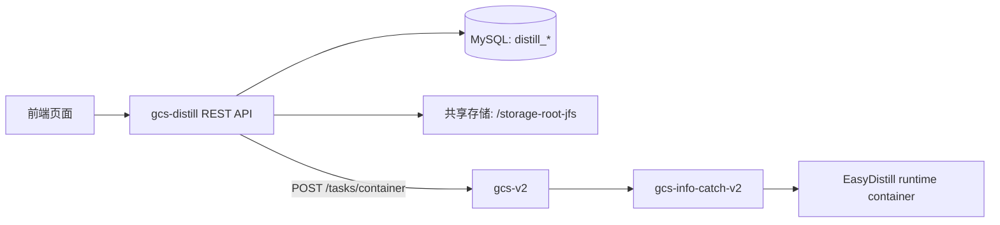

# GCS-Distill 前端接口到后端逻辑映射

本文用于前端、后端和调度侧一起对齐：前端每个接口怎么调，参数是什么，后端实际走哪段逻辑，哪些内容最终会变成 EasyDistill 容器的配置或启动参数。

服务入口：

```text
HTTP: http://<distill.host>:8080
API prefix: /api/v1
Swagger UI: /swagger/index.html
OpenAPI JSON: /swagger/openapi.json
```

## 0. uid 与用户目录

`uid` 是前端必须传给 `gcs-distill` 的 GCS 用户 ID。后端不会再从 `config.toml` 固定某个用户目录，而是统一按下面规则派生目录：

```text
storage.root_path=/storage-root-jfs
uid=380
=> /storage-root-jfs/user-380/train-center/model-distill
```

传参规则：

| 接口类别 | uid 位置 |
| --- | --- |
| `GET /projects`, `GET /projects/{id}`, `DELETE /projects/{id}` | query: `uid=380` |
| `POST /projects`, `PUT /projects/{id}` | JSON body: `uid` |
| `GET /datasets`, `GET /datasets/candidates`, `GET /datasets/{id}`, `DELETE /datasets/{id}` | query: `uid=380` |
| `POST /datasets`, `PUT /datasets/{id}` | JSON body: `uid` |
| `POST /datasets/upload` | multipart form: `uid` |
| `GET /pipelines` | query: `uid=380&project_id=...` |
| `POST /pipelines` | JSON body: `uid` |

创建流水线时后端会校验 `pipeline.uid == project.uid == dataset.uid`。提交到 `gcs-v2` 的容器任务会带 `task_uid=uid`，与 `gcs-v2` SFT 的目录组织一致。

## 1. 一句话理解链路

前端只调用 `gcs-distill`。`gcs-distill` 负责项目、数据集、流水线、阶段状态、EasyDistill 配置文件和共享存储目录；真正的容器创建、资源调度、镜像拉起、日志采集由 `gcs-v2` 和 `gcs-info-catch-v2` 完成。



启动流水线后，6 个阶段依次执行：

| 顺序 | 阶段 | 后端动作 | 是否进 EasyDistill 容器 |
| --- | --- | --- | --- |
| 1 | `teacher_config` | 校验教师模型配置 | 否 |
| 2 | `dataset_build` | 创建运行目录，读取数据集，写 `data/seed/instructions.json` 和 chat template | 否 |
| 3 | `teacher_infer` | 生成 `configs/teacher_infer.json`，提交教师推理容器 | 是 |
| 4 | `data_govern` | 读取教师生成结果，过滤、去重、拆分训练/测试集 | 否 |
| 5 | `student_train` | 生成 `configs/student_train.json`，提交学生训练容器 | 是 |
| 6 | `evaluate` | 生成 `configs/evaluate.json`，提交评估容器并解析结果 | 是 |

## 2. 通用约定

大多数 JSON 接口返回：

```ts
interface ApiResponse<T> {
  code: number;
  message: string;
  data?: T;
}
```

分页接口返回：

```ts
interface PageResult<T> {
  items: T[];
  total: number;
  page: number;
  page_size: number;
}
```

例外：

| 接口 | 返回格式 |
| --- | --- |
| `GET /pipelines/{id}/stages/{stage_id}/logs` | `text/plain` |
| `GET /pipelines/{id}/stages/{stage_id}/logs/stream` | `text/plain`，兼容别名，不是 SSE |
| `GET /pipelines/{id}/stages/{stage_id}/logs/ws` | WebSocket |
| `GET /pipelines/{id}/stages/{stage_id}/logs/download` | `application/octet-stream` |
| `/swagger/*` | HTML 或 JSON |

## 3. 前端字段如何进入 EasyDistill

### 3.1 项目字段

`Project` 保存教师模型、学生模型、评估配置。这些字段在创建项目时不会启动容器，但会在 `POST /pipelines/{id}/start` 后被 runtime 用来生成 EasyDistill 配置。

```ts
interface Project {
  id?: string;
  uid: number;
  name: string;
  description?: string;
  business_scenario?: string;
  teacher_model_config: ModelConfig;
  student_model_config: ModelConfig;
  evaluation_config?: EvaluationConfig;
}

interface ModelConfig {
  provider_type: "api" | "local";
  model_id?: string;
  model_name?: string;
  model_path?: string;
  endpoint?: string;
  api_secret_ref?: string;
  temperature?: number;
  max_tokens?: number;
  concurrency?: number;
  timeout_seconds?: number;
  extra_params?: Record<string, unknown>;
}

interface EvaluationConfig {
  metrics: string[];
  test_set_ratio: number;
  extra_params?: Record<string, unknown>;
}
```

映射关系：

| 前端字段 | 后端使用位置 | EasyDistill 含义 |
| --- | --- | --- |
| `teacher_model_config.provider_type="api"` | `runtime.GenerateTeacherInferConfig` | `job_type=kd_black_box_api` |
| `teacher_model_config.provider_type="local"` | `runtime.GenerateTeacherInferConfig` | `job_type=kd_black_box_local` |
| `teacher_model_config.model_id` | `ProjectService.resolveLocalModel` | 本地教师模型选择 ID，来自 `GET /models/teacher` |
| `teacher_model_config.model_name/model_path` | 教师推理配置 `models.teacher` | API 模式使用模型名，本地模式由后端解析成本地路径 |
| `teacher_model_config.endpoint` | 教师推理配置 `inference.base_url` | OpenAI-compatible 教师 API 地址 |
| `teacher_model_config.api_secret_ref` 或 `extra_params.api_key` | 教师推理配置 `inference.api_key` | 当前直接作为 EasyDistill 可用 key 写入配置 |
| `teacher_model_config.max_tokens` | 教师推理配置 `inference.max_new_tokens` | 教师生成最大 token |
| `teacher_model_config.extra_params.inference` | 教师推理配置 `inference.*` | 透传更多 EasyDistill 推理参数 |
| `student_model_config.model_id` | `ProjectService.resolveLocalModel` | 本地学生模型选择 ID，来自 `GET /models/student` |
| `student_model_config.model_path` | 学生训练配置 `models.student` | 后端根据 `model_id` 解析出的本地学生模型路径 |
| `evaluation_config.extra_params.base_url/api_key/max_new_tokens` | 评估配置 `inference.*` | 评估 judge API |

注意：后端要求学生模型必须是 `provider_type=local`。前端本地模型选择时提交 `model_id` 即可，后端会补齐 `model_name` 和 `model_path`；`model_path` 仅作为兼容旧客户端和运行配置字段保留，不建议前端手填。

### 3.2 数据集字段

```ts
interface Dataset {
  id?: string;
  uid: number;
  name: string;
  dataset_name?: string;
  description?: string;
  source_type: "upload" | "import";
  file_path?: string;
  record_count?: number;
}
```

`name` 是前端创建/登记数据集时填写的记录名称；`dataset_name` 是后端从 `file_path` 推导出的真实数据文件名，详情页可直接展示它作为“数据集名称”。

数据集是独立资源，不属于项目。创建流水线时再通过 `uid + project_id + dataset_id` 把项目配置和数据集组合起来执行。数据集文件最终在 `dataset_build` 阶段被读取，支持 JSON 数组或 JSONL/NDJSON。只要记录里有非空 `instruction` 字段，就会被写入运行目录：

```text
/storage-root-jfs/user-{uid}/train-center/model-distill/projects/{project_id}/runs/{pipeline_id}/data/seed/instructions.json
```

数据集根目录来自配置：

```text
/storage-root-jfs/user-{uid}/train-center/model-distill/datasets/candidates
默认: /storage-root-jfs/user-{uid}/train-center/model-distill/datasets/candidates
```

### 3.3 流水线字段

```ts
interface PipelineRun {
  id?: string;
  uid: number;
  project_id: string;
  dataset_id: string;
  trigger_mode?: "manual" | string;
  training_config: TrainingConfig;
  resource_request: ResourceRequest;
}

interface TrainingConfig {
  num_train_epochs: number;
  per_device_train_batch_size: number;
  gradient_accumulation_steps?: number;
  learning_rate: number;
  weight_decay?: number;
  warmup_ratio?: number;
  lr_scheduler_type?: string;
  save_steps?: number;
  logging_steps?: number;
  max_length?: number;
}

interface ResourceRequest {
  gpu_count: number;
  gpu_device_ids?: string;
  gpu_type?: string;
  memory_gb?: number;
  cpu_cores?: number;
  selected_resources?: SelectedResource[];
}

interface SelectedResource {
  node_name: string;
  node_address: string;
  xpu_indices: number[];
}
```

映射关系：

| 前端字段 | 后端使用位置 | 说明 |
| --- | --- | --- |
| `project_id` | 查询项目配置 | 决定教师/学生/评估配置 |
| `dataset_id` | 查询数据集文件 | 决定 `instructions.json` 的来源 |
| `training_config.*` | `student_train.json` 的 `training.*` | 进入 EasyDistill 学生训练配置 |
| `resource_request.gpu_count` | `gcs-v2` container task 的 `xpu_nums` | 决定申请 XPU 数量 |
| `resource_request.gpu_device_ids` | 计算 `xpu_nums` 的兜底来源 | 只表达卡号，不表达节点 |
| `resource_request.selected_resources` | `gcs-v2` container task 的 `selected_resources` | 手动指定节点和卡号 |
| `resource_request.gpu_type/memory_gb/cpu_cores` | 当前仅保存为流水线请求字段 | 目前没有继续传给 `gcs-v2` |

建议前端做手动选卡时优先使用 `selected_resources`，不要只用 `gpu_device_ids`，因为 `gpu_device_ids` 无法表达节点。

## 4. 全部接口清单

### 4.1 健康检查和文档

| 前端接口 | 参数 | 后端逻辑 | 是否进入 EasyDistill |
| --- | --- | --- | --- |
| `GET /health` | 无 | `server/router.go` 直接返回 `{status:"ok"}` | 否 |
| `GET /swagger` | 无 | 301 跳转到 `/swagger/index.html` | 否 |
| `GET /swagger/` | 无 | 301 跳转到 `/swagger/index.html` | 否 |
| `GET /swagger/index.html` | 无 | 返回内嵌 Swagger UI 页面 | 否 |
| `GET /swagger/openapi.json` | 无 | 返回内嵌 OpenAPI JSON | 否 |

### 4.2 项目接口

#### `POST /api/v1/projects`

用途：创建一个蒸馏项目，保存教师模型、学生模型、评估配置等元数据。

请求体：

```json
{
  "uid": 380,
  "name": "客服问答蒸馏",
  "description": "把大模型客服能力蒸馏到小模型",
  "business_scenario": "智能客服",
  "teacher_model_config": {
    "provider_type": "api",
    "model_name": "qwen-plus",
    "endpoint": "https://dashscope.aliyuncs.com/compatible-mode/v1",
    "api_secret_ref": "DASHSCOPE_API_KEY",
    "max_tokens": 512,
    "extra_params": {
      "stream": false,
      "system_prompt": "你是一个客服知识蒸馏教师模型"
    }
  },
  "student_model_config": {
    "provider_type": "local",
    "model_id": "Qwen2.5-0.5B-Instruct"
  },
  "evaluation_config": {
    "metrics": ["accuracy"],
    "test_set_ratio": 0.1,
    "extra_params": {
      "base_url": "https://dashscope.aliyuncs.com/compatible-mode/v1",
      "api_key": "DASHSCOPE_API_KEY",
      "max_new_tokens": 8196
    }
  }
}
```

后端链路：

```text
ProjectHandler.CreateProject
  -> ProjectService.CreateProject
  -> ProjectService.resolveLocalModel
  -> validateProject
  -> ProjectRepository.Create
  -> MySQL distill_projects
```

EasyDistill 关系：本接口不启动容器。项目里的模型配置会在后续 `POST /pipelines/{id}/start` 时被读取，用来生成 `teacher_infer.json`、`student_train.json`、`evaluate.json`。

#### `GET /api/v1/projects`

用途：分页获取项目列表。

Query 参数：

| 参数 | 默认 | 说明 |
| --- | --- | --- |
| `page` | `1` | 页码，小于 1 时按 1 |
| `page_size` | `20` | 每页数量，小于 1 或大于 100 时按 20 |

后端链路：

```text
ProjectHandler.ListProjects
  -> ProjectService.ListProjects
  -> ProjectRepository.List / Count
  -> MySQL distill_projects
```

EasyDistill 关系：无，只读数据库。

#### `GET /api/v1/projects/{id}`

用途：获取项目详情，前端编辑页、创建流水线页会用。

Path 参数：

| 参数 | 说明 |
| --- | --- |
| `id` | 项目 ID |

后端链路：

```text
ProjectHandler.GetProject
  -> ProjectService.GetProject
  -> ProjectRepository.GetByID
```

EasyDistill 关系：无，只读数据库。

#### `PUT /api/v1/projects/{id}`

用途：更新项目配置。

Path 参数：`id`。

请求体：同 `POST /api/v1/projects`，后端会用 path 里的 `id` 覆盖 body 里的 `id`。

后端链路：

```text
ProjectHandler.UpdateProject
  -> ProjectService.UpdateProject
  -> validateProject
  -> ProjectRepository.GetByID
  -> ProjectRepository.Update
```

EasyDistill 关系：本接口不影响已生成的历史运行目录；后续新启动的流水线会读取更新后的项目配置。

#### `DELETE /api/v1/projects/{id}`

用途：删除项目。

Path 参数：`id`。

后端链路：

```text
ProjectHandler.DeleteProject
  -> ProjectService.DeleteProject
  -> ProjectRepository.GetByID
  -> ProjectRepository.Delete
```

EasyDistill 关系：无。数据库层会按仓储实现处理关联数据；前端删除前应提示用户。

### 4.3 数据集接口

#### `GET /api/v1/datasets/candidates?uid=380`

用途：扫描共享目录，给前端数据集选择器展示可导入的数据文件。

参数：无。

后端链路：

```text
DatasetHandler.ListDatasetCandidates
  -> DatasetService.ListDatasetCandidates
  -> 扫描 /storage-root-jfs/user-{uid}/train-center/model-distill/datasets/candidates
```

返回数据：

```ts
interface DatasetCandidate {
  name: string;
  file_path: string;
  source_dir?: string;
  is_directory: boolean;
  size_bytes: number;
  updated_at: string;
  record_count: number;
}
```

支持文件扩展名：`.json`、`.jsonl`、`.ndjson`、`.txt`。

EasyDistill 关系：不启动容器，只给前端选数据。真正进入 EasyDistill 前，会先在 `dataset_build` 阶段转成运行目录里的 `instructions.json`。

#### `POST /api/v1/datasets`

用途：登记已有共享候选文件。推荐用于前端从 candidates 中选择数据集。

```json
{
  "uid": 380,
  "name": "customer-seed/train.jsonl",
  "description": "客服种子问题",
  "source_type": "import",
  "file_path": "/storage-root-jfs/user-{uid}/train-center/model-distill/datasets/candidates/customer-seed/train.jsonl"
}
```

注意：这个 JSON 接口只接受 `source_type=import`。上传新文件请调用 `POST /api/v1/datasets/upload`。

后端链路：

```text
DatasetHandler.CreateDataset
  -> DatasetService.CreateDataset
  -> prepareDataset
  -> 校验 source_type=import，file_path 位于 /storage-root-jfs/user-{uid}/train-center/model-distill/datasets/candidates
  -> DatasetRepository.Create
```

EasyDistill 关系：本接口不启动容器。数据集路径会在 `dataset_build` 阶段被读取。

#### `POST /api/v1/datasets/upload`

用途：上传新数据集文件。上传成功后，后端自动创建 `source_type=upload` 的数据集记录。

```text
Content-Type: multipart/form-data
fields:
  uid: required, GCS user id
  name: 可选
  description: 可选
  file: 文件
```

后端链路：

```text
DatasetHandler.UploadDataset
  -> DatasetService.CreateUploadedDataset
  -> 保存到 /storage-root-jfs/user-{uid}/train-center/model-distill/datasets/uploaded/{dataset_id}/{filename}
  -> 统计记录数
  -> DatasetRepository.Create
```

EasyDistill 关系：本接口不启动容器。后续流水线 `dataset_build` 阶段读取上传后的 `file_path`。

#### `GET /api/v1/datasets`

用途：分页获取所有已登记数据集。数据集是独立资源，不按项目过滤。

Query 参数：

| 参数 | 必填 | 默认 | 说明 |
| --- | --- | --- | --- |
| `page` | 否 | `1` | 页码 |
| `page_size` | 否 | `20` | 每页数量 |

后端链路：

```text
DatasetHandler.ListDatasets
  -> DatasetService.ListDatasets
  -> DatasetRepository.List / Count
```

EasyDistill 关系：无，只读数据库。

#### `GET /api/v1/datasets/{id}`

用途：获取数据集详情。

Path 参数：`id`。

响应里的 `data.dataset_name` 是后端从 `file_path` 推导出的真实数据文件名，用于详情页展示“数据集名称”；`data.name` 保留为创建/登记时填写的记录名称。

后端链路：

```text
DatasetHandler.GetDataset
  -> DatasetService.GetDataset
  -> DatasetRepository.GetByID
```

EasyDistill 关系：无，只读数据库。

#### `PUT /api/v1/datasets/{id}`

用途：更新数据集展示信息。数据集的 `source_type`、`file_path` 和 `record_count` 是后端创建时确定的，不通过更新接口改动。

Path 参数：`id`。

请求体：

```json
{
  "uid": 380,
  "name": "customer-seed/train-v2.jsonl",
  "description": "更新后的数据集说明"
}
```

后端链路：

```text
DatasetHandler.UpdateDataset
  -> DatasetService.UpdateDataset
  -> DatasetRepository.GetByID
  -> 校验 uid 属于当前数据集
  -> 保留已有 source_type/file_path/record_count
  -> DatasetRepository.Update
```

EasyDistill 关系：不会改变数据文件位置，也不会影响已经启动过的流水线；后续新流水线仍读取原来的数据集文件路径。

#### `DELETE /api/v1/datasets/{id}`

用途：删除数据集记录。

Path 参数：`id`。

后端链路：

```text
DatasetHandler.DeleteDataset
  -> DatasetService.DeleteDataset
  -> DatasetRepository.GetByID
  -> 非 import 数据集会尝试删除后端拥有的上传文件
  -> DatasetRepository.Delete
```

EasyDistill 关系：无。不会主动删除历史运行目录里的 `data/seed` 文件。

### 4.4 模型接口

#### `GET /api/v1/models/teacher`

用途：列出可作为本地教师模型的模型目录。只有当创建项目时 `teacher_model_config.provider_type=local`，前端才需要调用它；如果教师模型使用 API 模式，则不需要调用。

参数：无。

后端链路：

```text
ModelHandler.ListTeacherModels
  -> ModelService.ListTeacherModels
  -> 扫描 storage.models_base_path
  -> 只返回包含 config.json 的目录
```

返回：

```ts
interface TeacherModel {
  id: string;
  name: string;
  path: string;
  description: string;
  size: number;
}
```

EasyDistill 关系：不启动容器。前端选择本地教师模型后应提交 `id` 到 `project.teacher_model_config.model_id`；后端会解析出 `model_path`，后续进入 EasyDistill 配置里的 teacher 模型字段。

#### `GET /api/v1/models/teacher/{id}`

用途：获取单个本地教师模型详情。

Path 参数：

| 参数 | 说明 |
| --- | --- |
| `id` | 模型目录名，不能包含 `..`、`/`、`\` |

后端链路：

```text
ModelHandler.GetTeacherModel
  -> ModelService.GetTeacherModel
  -> 校验目录存在且包含 config.json
```

EasyDistill 关系：无，只读本地共享模型目录。

#### `GET /api/v1/models/student`

用途：列出可作为学生模型的本地模型目录。

参数：无。

后端链路：

```text
ModelHandler.ListStudentModels
  -> ModelService.ListStudentModels
  -> 扫描 storage.models_base_path
  -> 只返回包含 config.json 的目录
```

返回：

```ts
interface StudentModel {
  id: string;
  name: string;
  path: string;
  description: string;
  size: number;
}
```

EasyDistill 关系：不启动容器。前端选择学生模型后应提交 `id` 到 `project.student_model_config.model_id`；后端会解析出 `model_path`，后续进入 EasyDistill 配置里的 student 模型字段。

#### `GET /api/v1/models/student/{id}`

用途：获取单个学生模型详情。

Path 参数：

| 参数 | 说明 |
| --- | --- |
| `id` | 模型目录名，不能包含 `..`、`/`、`\` |

后端链路：

```text
ModelHandler.GetStudentModel
  -> ModelService.GetStudentModel
  -> 校验目录存在且包含 config.json
```

EasyDistill 关系：无，只读本地共享模型目录。

### 4.5 资源接口

#### `GET /api/v1/resources/available`

用途：给前端资源选择器用。它把 `gcs-v2` 的 brain worker 和 swarm node 信息合成前端更容易消费的结构。

参数：无。

后端链路：

```text
ResourceHandler.Available
  -> ResourceService.Available
  -> gcs-v2 GET /brain
  -> gcs-v2 GET /nodes
  -> 按 worker name/address 合并
```

返回核心字段：

```ts
interface AvailableNode {
  name: string;
  address: string;
  available: boolean;
  workers_xpuname: string;
  workers_xpucount: number;
  enable_xpu_indices: number[];
  node_cpus: number;
  node_memory: number;
  node_state: string;
  node_availability: string;
  node_role: string;
  node_os: string;
  node_architecture: string;
  raw: unknown;
}
```

前端映射到流水线提交：

```json
{
  "resource_request": {
    "gpu_count": 2,
    "selected_resources": [
      {
        "node_name": "gpu-node-01",
        "node_address": "172.18.36.225",
        "xpu_indices": [0, 1]
      }
    ]
  }
}
```

EasyDistill 关系：不直接进入 EasyDistill 配置。`selected_resources` 会在容器任务提交时透传给 `gcs-v2`，由 `gcs-v2/gcs-info-catch-v2` 决定实际节点和卡。

#### `GET /api/v1/resources/nodes`

用途：查看原始 `gcs-v2` node 快照，主要用于排障或高级展示。

参数：无。

后端链路：

```text
ResourceHandler.ListNodes
  -> gcsClient.ListNodes
  -> gcs-v2 GET /nodes
```

EasyDistill 关系：无。普通资源选择 UI 优先用 `/resources/available`。

#### `GET /api/v1/resources/nodes/{name}`

用途：按 hostname/name/id 获取一个原始节点快照。

Path 参数：

| 参数 | 说明 |
| --- | --- |
| `name` | `node_hostname`、`node_name`、`name` 或 `node_id` |

后端链路：

```text
ResourceHandler.GetNode
  -> gcsClient.GetNode
  -> gcs-v2 GET /nodes
  -> 本地遍历匹配 node_hostname/node_name/name/node_id
```

EasyDistill 关系：无。

### 4.6 流水线接口

#### `POST /api/v1/pipelines`

用途：创建一次蒸馏运行记录和 6 个阶段记录。注意：创建不等于启动。

请求体：

```json
{
  "uid": 380,
  "project_id": "uuid-project",
  "dataset_id": "uuid-dataset",
  "trigger_mode": "manual",
  "training_config": {
    "num_train_epochs": 3,
    "per_device_train_batch_size": 4,
    "gradient_accumulation_steps": 1,
    "learning_rate": 0.00002,
    "weight_decay": 0.01,
    "warmup_ratio": 0.03,
    "lr_scheduler_type": "cosine",
    "save_steps": 100,
    "logging_steps": 10,
    "max_length": 4096
  },
  "resource_request": {
    "gpu_count": 2,
    "selected_resources": [
      {
        "node_name": "gpu-node-01",
        "node_address": "172.18.36.225",
        "xpu_indices": [0, 1]
      }
    ]
  }
}
```

后端链路：

```text
PipelineHandler.CreatePipeline
  -> PipelineService.CreatePipeline
  -> validatePipeline
     - uid 必须大于 0
     - project_id 必须存在
     - dataset_id 必须存在
     - project.uid == dataset.uid == pipeline.uid
     - num_train_epochs > 0
     - learning_rate > 0
     - gpu_count >= 0
  -> PipelineRepository.Create(status=pending,current_stage=0)
  -> StageRepository.Create 六个 pending 阶段
```

EasyDistill 关系：不启动容器，不生成配置文件，只创建数据库记录。真正执行在 `POST /pipelines/{id}/start`。

#### `GET /api/v1/pipelines`

用途：分页获取某个项目下的流水线运行列表。

Query 参数：

| 参数 | 必填 | 默认 | 说明 |
| --- | --- | --- | --- |
| `uid` | 是 | 无 | 当前用户 ID，只返回该用户的流水线 |
| `project_id` | 是 | 无 | 项目 ID |
| `page` | 否 | `1` | 页码 |
| `page_size` | 否 | `20` | 每页数量 |

后端链路：

```text
PipelineHandler.ListPipelines
  -> PipelineService.ListPipelines
  -> PipelineRepository.List / CountByProject
```

EasyDistill 关系：无，只读数据库。

#### `GET /api/v1/pipelines/{id}`

用途：获取流水线详情。

Path 参数：`id`。

后端链路：

```text
PipelineHandler.GetPipeline
  -> PipelineService.GetPipeline
  -> PipelineRepository.GetByID
```

EasyDistill 关系：无，只读数据库。

#### `POST /api/v1/pipelines/{id}/start`

用途：启动 pending 状态的流水线。这个接口是从前端操作进入 EasyDistill 容器链路的关键入口。

Path 参数：`id`。

请求体：无。

后端链路：

```text
PipelineHandler.StartPipeline
  -> PipelineService.StartPipeline
  -> 校验 pipeline.status == pending
  -> pipeline.status = running
  -> current_stage = 1
  -> 第 1 阶段 teacher_config 标记 running
  -> ExecutorService.SubmitPipeline
  -> 后台 executorService.executePipeline
  -> runtime.StageExecutor.ExecuteStage
```

阶段执行时的容器穿透：

| 阶段 | 后端生成 | 提交给 gcs-v2 的容器命令 |
| --- | --- | --- |
| `teacher_infer` | `configs/teacher_infer.json` | `python -m easydistill.kd.infer --config <config>` |
| `student_train` | `configs/student_train.json` | `accelerate launch [--multi_gpu] --num_processes <n> --module easydistill.kd.train --config <config>` |
| `evaluate` | `configs/evaluate.json` | `python -m easydistill.eval.data_eval --config <config>` |

提交给 `gcs-v2` 的核心任务字段：

```json
{
  "task_uid": 380,
  "container_name": "distill-<pipeline_id>-<stage_type>",
  "image": "easy-distill/easydistill:latest",
  "command": "python 或 accelerate",
  "args": ["..."],
  "working_dir": "/storage-root-jfs/user-{uid}/train-center/model-distill/projects/<project_id>/runs/<pipeline_id>",
  "log_path": "/storage-root-jfs/user-{uid}/train-center/model-distill/projects/<project_id>/runs/<pipeline_id>/logs/<stage>",
  "envs": "GCS_DISTILL_STAGE=<stage>;GCS_DISTILL_PIPELINE_ID=<pipeline_id>",
  "worker_nums": 1,
  "xpu_nums": 2,
  "selected_resources": [
    {
      "node_name": "gpu-node-01",
      "node_address": "172.18.36.225",
      "xpu_indices": [0, 1]
    }
  ]
}
```

EasyDistill 关系：是。这个接口会间接启动 EasyDistill runtime 容器，但容器不是由 `gcs-distill` 直接 `docker run`，而是通过 `gcs-v2 POST /tasks/container` 提交。

#### `POST /api/v1/pipelines/{id}/cancel`

用途：取消 pending 或 running 的流水线。

Path 参数：`id`。

请求体：无。

后端链路：

```text
PipelineHandler.CancelPipeline
  -> PipelineService.CancelPipeline
  -> 校验状态 pending/running
  -> 当前阶段标记 canceled
  -> pipeline.status = canceled
```

EasyDistill 关系：当前实现只更新数据库状态，不会主动调用 `gcs-v2 DELETE /tasks/{container}` 杀掉已经运行的容器。前端应把它理解为“业务取消标记”；如果要强杀容器，需要后端另补停止任务逻辑。

#### `GET /api/v1/pipelines/{id}/stages`

用途：获取流水线的 6 个阶段，用于进度条、阶段列表、日志按钮、配置路径、指标展示。

Path 参数：`id`。

后端链路：

```text
PipelineHandler.ListStages
  -> PipelineService.ListStages
  -> StageRepository.ListByPipeline
```

返回核心字段：

```ts
interface StageRun {
  id: string;
  pipeline_run_id: string;
  stage_type: "teacher_config" | "dataset_build" | "teacher_infer" | "data_govern" | "student_train" | "evaluate";
  stage_order: number;
  status: "pending" | "running" | "succeeded" | "failed" | "canceled";
  container_id?: string;
  node_name?: string;
  config_path?: string;
  output_manifest?: Record<string, string>;
  metrics?: Record<string, unknown>;
  log_path?: string;
  error_message?: string;
}
```

EasyDistill 关系：无，只读阶段状态。`teacher_infer/student_train/evaluate` 阶段成功提交容器后会有 `container_id` 和 `log_path`。

### 4.7 阶段日志接口

日志接口都先通过 `stage_id` 找阶段记录，再检查它是否属于 path 里的 `pipeline_id`，最后用阶段记录里的 `container_id` 去代理 `gcs-v2` task 日志。

没有 `container_id` 的阶段，例如 `teacher_config`、`dataset_build`、`data_govern`，日志接口会返回 404。前端显示“该阶段暂无容器日志”即可。

#### `GET /api/v1/pipelines/{id}/stages/{stage_id}/logs`

用途：拉取阶段日志尾部内容。

Path 参数：

| 参数 | 说明 |
| --- | --- |
| `id` | 流水线 ID |
| `stage_id` | 阶段 ID |

Query 参数：

| 参数 | 默认 | 说明 |
| --- | --- | --- |
| `tail` | `100` | 返回最后多少行，透传给 `gcs-v2` |

后端链路：

```text
PipelineHandler.GetStageLogs
  -> stageLogTarget
  -> PipelineService.GetStage
  -> gcsClient.GetTaskLogs
  -> gcs-v2 GET /tasks/{containerName}/logs?tail=<tail>
```

EasyDistill 关系：不进容器，只读 `gcs-v2` 收集到的容器日志。

#### `GET /api/v1/pipelines/{id}/stages/{stage_id}/logs/stream`

用途：兼容旧前端的日志接口。

参数：同 `/logs`。

后端链路：直接调用 `GetStageLogs`。

EasyDistill 关系：不进容器。它不是 SSE，只是 `text/plain` tail。

#### `GET /api/v1/pipelines/{id}/stages/{stage_id}/logs/ws`

用途：实时查看容器日志。

Path 参数：同 `/logs`。

Query 参数：

| 参数 | 默认 | 说明 |
| --- | --- | --- |
| `tail` | `100` | 建连时初始 tail 行数 |

后端链路：

```text
PipelineHandler.StreamStageLogsWebSocket
  -> stageLogTarget
  -> gcsClient.TaskLogsWebSocketURL
  -> gcs-v2 WS /tasks/{containerName}/logs/ws?tail=<tail>
  -> gcs-distill 在两个 WebSocket 之间转发消息
```

EasyDistill 关系：不进容器，只代理 `gcs-v2` 的日志 WebSocket。

#### `GET /api/v1/pipelines/{id}/stages/{stage_id}/logs/download`

用途：下载阶段日志文件。

Path 参数：同 `/logs`。

Query 参数：

| 参数 | 默认 | 说明 |
| --- | --- | --- |
| `tail` | `10000` | 下载最后多少行 |

后端链路：

```text
PipelineHandler.DownloadStageLogs
  -> stageLogTarget
  -> gcsClient.GetTaskLogs
  -> gcs-v2 GET /tasks/{containerName}/logs?tail=<tail>
  -> application/octet-stream
```

EasyDistill 关系：不进容器，只下载 `gcs-v2` 日志内容。

## 5. EasyDistill 容器配置明细

### 5.1 教师推理阶段

生成文件：

```text
{workspace}/configs/teacher_infer.json
```

配置大致结构：

```json
{
  "job_type": "kd_black_box_api",
  "dataset": {
    "instruction_path": ".../data/seed/instructions.json",
    "labeled_path": ".../data/generated/labeled.json",
    "template": ".../chat_template/chat_template_kd.jinja",
    "seed": 42
  },
  "inference": {
    "base_url": "https://...",
    "api_key": "...",
    "max_new_tokens": 512
  },
  "models": {
    "teacher": "qwen-plus",
    "student": "/storage-root-jfs/train-base-models/Qwen2.5-0.5B-Instruct"
  }
}
```

容器命令：

```text
python -m easydistill.kd.infer --config {workspace}/configs/teacher_infer.json
```

### 5.2 学生训练阶段

生成文件：

```text
{workspace}/configs/student_train.json
```

配置大致结构：

```json
{
  "job_type": "kd_black_box_train_only",
  "dataset": {
    "labeled_path": ".../data/filtered/train.json",
    "template": ".../chat_template/chat_template_kd.jinja",
    "seed": 42
  },
  "models": {
    "teacher": "qwen-plus",
    "student": "/storage-root-jfs/train-base-models/Qwen2.5-0.5B-Instruct"
  },
  "training": {
    "output_dir": ".../models/checkpoints",
    "num_train_epochs": 3,
    "per_device_train_batch_size": 4,
    "gradient_accumulation_steps": 1,
    "max_length": 4096,
    "save_steps": 100,
    "logging_steps": 10,
    "learning_rate": 0.00002,
    "weight_decay": 0.01,
    "warmup_ratio": 0.03,
    "lr_scheduler_type": "cosine"
  }
}
```

容器命令：

```text
accelerate launch --multi_gpu --num_processes <xpu_nums> --module easydistill.kd.train --config {workspace}/configs/student_train.json
```

如果 `xpu_nums=1`，不会加 `--multi_gpu`。

### 5.3 评估阶段

生成文件：

```text
{workspace}/configs/evaluate.json
```

配置大致结构：

```json
{
  "job_type": "cot_eval_api",
  "dataset": {
    "input_path": ".../data/filtered/test.json",
    "output_path": ".../eval/results.json"
  },
  "inference": {
    "base_url": "https://...",
    "api_key": "...",
    "max_new_tokens": 8196
  }
}
```

容器命令：

```text
python -m easydistill.eval.data_eval --config {workspace}/configs/evaluate.json
```

## 6. 推荐前端页面调用顺序

创建并启动一次流水线的推荐顺序：

1. 如果教师模型选择本地，调用 `GET /api/v1/models/teacher`：选择教师模型；如果选择 API 模式，则跳过这一步。
2. `GET /api/v1/models/student`：选择学生模型。
3. `GET /api/v1/resources/available`：选择节点和卡。
4. `POST /api/v1/projects`：创建项目，保存教师/学生/评估配置。
5. `GET /api/v1/datasets`：选择已登记数据集；如需新增，先从 `GET /api/v1/datasets/candidates?uid=380` 选择并 `POST /api/v1/datasets` 登记，或用 `POST /api/v1/datasets/upload` 上传新数据。
6. `POST /api/v1/pipelines`：创建流水线和 6 个阶段，提交 `uid + project_id + dataset_id`。
7. `POST /api/v1/pipelines/{id}/start`：启动后台执行。
8. 轮询 `GET /api/v1/pipelines/{id}` 和 `GET /api/v1/pipelines/{id}/stages`：刷新总状态和阶段状态。
9. 对有 `container_id` 的阶段调用 `/logs` 或 `/logs/ws`：查看容器日志。
10. 结束后从 `evaluate` 阶段的 `metrics/output_manifest` 查看评估结果路径和指标。

## 7. 当前实现边界

- 前端不需要直接调用 `gcs-v2` 或 EasyDistill。
- `POST /pipelines` 只创建记录，不启动执行。
- `POST /pipelines/{id}/start` 才会进入后台执行器，并间接提交 EasyDistill 容器。
- `POST /pipelines/{id}/cancel` 当前只更新业务状态，不强杀已经运行的 `gcs-v2` 容器。
- `gpu_type`、`memory_gb`、`cpu_cores` 当前只保存在流水线请求里，没有传给 `gcs-v2`。
- `logs/stream` 是兼容别名，不是 SSE；实时日志请用 `logs/ws`。
- 只有 `teacher_infer`、`student_train`、`evaluate` 三个阶段有 EasyDistill 容器日志。
