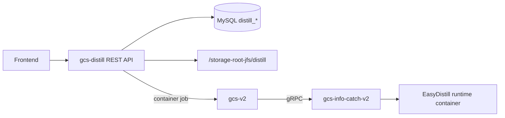

# GCS-Distill 前端对接交接文档

本文面向前端实现人员，说明 `gcs-distill` 的页面范围、接口契约、核心数据结构、状态流转和实现注意事项。

## 1. 服务入口

默认服务端口来自 `config.toml`：

```text
HTTP: http://<distill.host>:8080
API prefix: /api/v1
Swagger UI: http://<distill.host>:8080/swagger/index.html
OpenAPI JSON: http://<distill.host>:8080/swagger/openapi.json
Health: http://<distill.host>:8080/health
```

接口当前无登录鉴权中间件，已启用 CORS。生产环境如果需要鉴权，建议在网关或上层平台统一补齐，不要在前端假设接口永远裸露。

## 2. 产品边界

`gcs-distill` 是蒸馏编排控制面，只负责项目、数据集、流水线、阶段状态、配置文件和日志路径。

容器执行链路不在本服务内完成：



前端只和 `gcs-distill` REST API 对接。资源节点数据由 `gcs-distill` 代理 `gcs-v2` 返回，前端不需要直接调用 `gcs-v2`。

### EasyDistill 参数合同

前端表单不需要暴露 EasyDistill 原始配置文件，但必须提供后端生成配置所需的业务字段：

| 前端字段 | 写入 EasyDistill 配置 | 说明 |
| --- | --- | --- |
| `teacher_model_config.provider_type=api` | `job_type=kd_black_box_api` | 教师推理走 OpenAI-compatible API |
| `teacher_model_config.provider_type=local` | `job_type=kd_black_box_local` | 教师推理走本地模型，必须提供 `model_path` |
| `teacher_model_config.endpoint` | `inference.base_url` | API 教师模型地址 |
| `teacher_model_config.api_secret_ref` 或 `extra_params.api_key` | `inference.api_key` | 当前 EasyDistill 需要可直接使用的 key 字符串 |
| `student_model_config.model_path` | `models.student` | 学生模型本地路径 |
| `training_config.*` | `training.*` | 只映射 EasyDistill SFTConfig 可识别字段，不再提交 `lora_config` |
| `evaluation_config.extra_params.base_url/api_key/max_new_tokens` | `evaluate.inference.*` | 评估阶段 judge API；缺省时 API 教师模型配置可作为回退 |

数据集上传可以是 JSONL 或 JSON 数组。后端在 `dataset_build` 阶段会统一写成 EasyDistill 当前 loader 可读取的 JSON 数组：

- `data/seed/instructions.json`
- `data/generated/labeled.json`
- `data/filtered/train.json`
- `data/filtered/test.json`

容器阶段由后端显式提交模块命令，不依赖 runtime 镜像默认 ENTRYPOINT：教师推理使用 `python -m easydistill.kd.infer`，学生训练使用 `accelerate launch --module easydistill.kd.train`，评估使用 `python -m easydistill.eval.data_eval`。

## 3. 推荐页面拆分

| 页面 | 主要能力 | 关键接口 |
| --- | --- | --- |
| 项目列表 | 分页查看、创建、删除项目 | `GET /projects`, `POST /projects`, `DELETE /projects/{id}` |
| 项目详情 | 项目信息、教师/学生模型配置、评估配置 | `GET /projects/{id}`, `PUT /projects/{id}` |
| 数据集管理 | 上传文件、登记已有路径、查看记录数 | `POST /projects/{id}/datasets`, `POST /datasets`, `GET /datasets?project_id=` |
| 流水线列表 | 查看项目下所有运行记录 | `GET /pipelines?project_id=` |
| 创建流水线 | 选择项目、数据集、训练参数、资源 | `POST /pipelines` |
| 流水线详情 | 状态轮询、阶段进度、日志查看、取消 | `GET /pipelines/{id}`, `GET /pipelines/{id}/stages`, `POST /pipelines/{id}/start`, `POST /pipelines/{id}/cancel` |
| 学生模型选择 | 从共享模型目录选择本地学生模型 | `GET /models/student` |
| 资源选择 | 查看节点，选择 GPU/NPU 节点和卡号 | `GET /resources/nodes`, `GET /resources/nodes/{name}` |

## 4. 通用响应和错误处理

绝大多数 JSON 接口返回统一结构：

```ts
export interface ApiResponse<T> {
  code: number;
  message: string;
  data?: T;
}
```

分页列表统一结构：

```ts
export interface PageResult<T> {
  items: T[];
  total: number;
  page: number;
  page_size: number;
}
```

前端处理建议：

- HTTP `2xx` 但 `code` 非 200 时，仍按业务失败展示 `message`。
- HTTP `400` 多为参数校验错误，可直接 toast `message`。
- HTTP `404` 表示项目、数据集、流水线、阶段或模型不存在。
- HTTP `500` 多为数据库、共享存储、GCS 或文件读取问题，应提示用户重试并保留错误详情。
- `page_size` 后端最大有效值为 100，超出会回落为 20。

## 5. TypeScript 数据模型

```ts
export type ProviderType = "api" | "local";

export type PipelineStatus =
  | "pending"
  | "scheduled"
  | "preparing"
  | "running"
  | "succeeded"
  | "failed"
  | "canceled";

export type StageType =
  | "teacher_config"
  | "dataset_build"
  | "teacher_infer"
  | "data_govern"
  | "student_train"
  | "evaluate";

export interface ModelConfig {
  provider_type: ProviderType;
  model_name: string;
  model_path?: string;
  endpoint?: string;
  api_secret_ref?: string;
  temperature?: number;
  max_tokens?: number;
  concurrency?: number;
  timeout_seconds?: number;
  extra_params?: Record<string, unknown>;
}

export interface EvaluationConfig {
  metrics: string[];
  test_set_ratio: number;
  extra_params?: Record<string, unknown>;
}

export interface Project {
  id?: string;
  name: string;
  description?: string;
  business_scenario?: string;
  teacher_model_config: ModelConfig;
  student_model_config: ModelConfig;
  evaluation_config?: EvaluationConfig;
  created_at?: string;
  updated_at?: string;
}

export interface Dataset {
  id?: string;
  project_id: string;
  name: string;
  description?: string;
  source_type: "upload" | "import" | "generated";
  file_path?: string;
  record_count?: number;
  created_at?: string;
}

export interface TrainingConfig {
  num_train_epochs: number;
  per_device_train_batch_size: number;
  gradient_accumulation_steps?: number;
  learning_rate: number;
  weight_decay?: number;
  warmup_ratio?: number;
  lr_scheduler_type?: string;
  save_steps?: number;
  logging_steps?: number;
  max_length?: number;
}

export interface SelectedResource {
  node_name: string;
  node_address: string;
  xpu_indices: number[];
}

export interface ResourceRequest {
  gpu_count: number;
  gpu_device_ids?: string;
  gpu_type?: string;
  memory_gb?: number;
  cpu_cores?: number;
  selected_resources?: SelectedResource[];
}

export interface PipelineRun {
  id?: string;
  project_id: string;
  dataset_id: string;
  status?: PipelineStatus;
  current_stage?: number;
  trigger_mode?: "manual" | string;
  training_config: TrainingConfig;
  resource_request: ResourceRequest;
  error_message?: string;
  created_at?: string;
  started_at?: string;
  finished_at?: string;
  updated_at?: string;
}

export interface StageRun {
  id: string;
  pipeline_run_id: string;
  stage_type: StageType;
  stage_order: number;
  status: PipelineStatus;
  container_id?: string;
  node_name?: string;
  config_path?: string;
  input_manifest?: Record<string, string>;
  output_manifest?: Record<string, string>;
  metrics?: Record<string, unknown>;
  log_path?: string;
  retry_count: number;
  error_message?: string;
  started_at?: string;
  finished_at?: string;
  created_at: string;
  updated_at: string;
}

export interface StudentModel {
  id: string;
  name: string;
  path: string;
  description: string;
  size: number;
}
```

## 6. 核心业务流程

### 6.1 创建项目

后端会自动生成 `id`，前端创建时不需要传。

```http
POST /api/v1/projects
Content-Type: application/json
```

```json
{
  "name": "Qwen 蒸馏实验",
  "description": "客服场景蒸馏",
  "business_scenario": "customer_service",
  "teacher_model_config": {
    "provider_type": "api",
    "model_name": "qwen-max",
    "endpoint": "https://dashscope.aliyuncs.com/compatible-mode/v1",
    "api_secret_ref": "DASHSCOPE_API_KEY",
    "temperature": 0.7,
    "max_tokens": 2048,
    "concurrency": 4,
    "timeout_seconds": 60
  },
  "student_model_config": {
    "provider_type": "local",
    "model_name": "Qwen2.5-7B",
    "model_path": "/storage-root-jfs/distill/models/Qwen2.5-7B"
  },
  "evaluation_config": {
    "metrics": ["accuracy", "rouge"],
    "test_set_ratio": 0.1,
    "extra_params": {
      "base_url": "https://dashscope.aliyuncs.com/compatible-mode/v1",
      "api_key": "DASHSCOPE_API_KEY",
      "max_new_tokens": 8196
    }
  }
}
```

校验规则：

- `name` 必填，最大 255 字符。
- `teacher_model_config.model_name` 必填。
- `teacher_model_config.provider_type` 只能是 `api` 或 `local`。
- `student_model_config.provider_type` 必须是 `local`。
- `student_model_config.model_path` 必填。

### 6.2 数据集上传或登记

推荐前端优先使用上传接口：

```http
POST /api/v1/projects/{project_id}/datasets
Content-Type: multipart/form-data
```

表单字段：

| 字段 | 必填 | 说明 |
| --- | --- | --- |
| `file` | 是 | 数据集文件，建议 JSONL，每行一条样本 |
| `name` | 否 | 不填时使用文件名 |
| `description` | 否 | 数据集说明 |

上传后后端会把文件保存到共享存储，并统计非空行数作为 `record_count`。

如果数据已经在共享存储上，也可以登记路径：

```http
POST /api/v1/datasets
Content-Type: application/json
```

```json
{
  "project_id": "project-id",
  "name": "种子数据",
  "description": "已存在共享存储上的 JSONL",
  "source_type": "import",
  "file_path": "/storage-root-jfs/distill/imports/seeds.jsonl",
  "record_count": 1000
}
```

`source_type` 只能是 `upload`、`import`、`generated`。

### 6.3 创建流水线

创建流水线只生成运行记录和六个阶段，不会立即执行。创建成功后需要调用 `POST /pipelines/{id}/start`。

```http
POST /api/v1/pipelines
Content-Type: application/json
```

```json
{
  "project_id": "project-id",
  "dataset_id": "dataset-id",
  "trigger_mode": "manual",
  "training_config": {
    "num_train_epochs": 3,
    "per_device_train_batch_size": 2,
    "gradient_accumulation_steps": 4,
    "learning_rate": 0.00002,
    "weight_decay": 0.01,
    "warmup_ratio": 0.03,
    "lr_scheduler_type": "cosine",
    "save_steps": 100,
    "logging_steps": 10,
    "max_length": 4096
  },
  "resource_request": {
    "gpu_count": 1,
    "gpu_type": "nvidia",
    "memory_gb": 80,
    "selected_resources": [
      {
        "node_name": "gpu-node-01",
        "node_address": "172.18.36.225",
        "xpu_indices": [0]
      }
    ]
  }
}
```

校验规则：

- `project_id` 必填且项目必须存在。
- `dataset_id` 必填且数据集必须存在。
- `training_config.num_train_epochs > 0`。
- `training_config.learning_rate > 0`。
- `resource_request.gpu_count >= 0`。
- `selected_resources` 可选；为空时由 `gcs-v2` 自动调度，非空时按指定节点和卡号提交。

### 6.4 启动、轮询和取消

启动：

```http
POST /api/v1/pipelines/{id}/start
```

只有 `pending` 状态允许启动。启动后后端会把流水线状态置为 `running`，并从第 1 阶段开始推进。

轮询建议：

- 流水线详情：`GET /api/v1/pipelines/{id}`，间隔 2-5 秒。
- 阶段详情：`GET /api/v1/pipelines/{id}/stages`，间隔 2-5 秒。
- 当流水线进入 `succeeded`、`failed`、`canceled` 后停止轮询。

取消：

```http
POST /api/v1/pipelines/{id}/cancel
```

只有 `pending` 和 `running` 状态允许取消。

## 7. 阶段展示

创建流水线时后端固定创建六个阶段：

| 顺序 | stage_type | 前端名称 | 执行位置 |
| --- | --- | --- | --- |
| 1 | `teacher_config` | 教师模型配置校验 | gcs-distill 进程内 |
| 2 | `dataset_build` | 数据集工作目录构建 | gcs-distill 进程内 |
| 3 | `teacher_infer` | 教师推理与样本生成 | gcs-v2 container job |
| 4 | `data_govern` | 数据治理和训练集切分 | gcs-distill 进程内 |
| 5 | `student_train` | 学生模型训练 | gcs-v2 container job |
| 6 | `evaluate` | 效果评估 | gcs-v2 container job |

状态展示建议：

| status | UI 建议 |
| --- | --- |
| `pending` | 灰色，等待执行 |
| `scheduled` | 蓝色，已调度 |
| `preparing` | 蓝色，准备中 |
| `running` | 高亮并展示 spinner |
| `succeeded` | 绿色完成 |
| `failed` | 红色失败，展示 `error_message` |
| `canceled` | 黄色/灰色取消 |

`current_stage` 是当前阶段序号，从 1 到 6。`current_stage = 0` 表示尚未启动。

## 8. 日志对接

完整日志：

```http
GET /api/v1/pipelines/{pipeline_id}/stages/{stage_id}/logs
```

Tail 日志：

```http
GET /api/v1/pipelines/{pipeline_id}/stages/{stage_id}/logs/stream?tail=100
```

下载日志：

```http
GET /api/v1/pipelines/{pipeline_id}/stages/{stage_id}/logs/download
```

注意：

- `logs/stream` 当前不是 SSE，也不是 WebSocket，而是一次性返回最近 N 行日志；前端如需“实时日志”，需要定时轮询该接口。
- 阶段尚未开始时，接口会返回 200，并在 `data.logs` 中提示“日志路径尚未设置”。
- 日志文件不存在或读取失败时，接口也可能返回 200，并把失败信息放在 `data.logs` 里。前端日志面板应直接展示 `data.logs`。

## 9. 资源选择对接

节点列表：

```http
GET /api/v1/resources/nodes
```

节点详情：

```http
GET /api/v1/resources/nodes/{name}
```

返回结构来自 `gcs-v2`，字段可能随调度侧演进。前端实现建议：

- 优先透传展示节点名、地址、可用 XPU/GPU 数、卡索引、显存、状态等可识别字段。
- 手动资源选择时，最终提交给流水线的结构固定为：

```json
{
  "selected_resources": [
    {
      "node_name": "gpu-node-01",
      "node_address": "172.18.36.225",
      "xpu_indices": [0, 1]
    }
  ]
}
```

- 如果不做手动选择，只传 `gpu_count`，让 `gcs-v2` 自动调度。
- 不建议只使用 `gpu_device_ids`，它只能表达卡号，不能表达节点，跨节点选择时语义不足。

## 10. 前端 API Client 示例

```ts
const API_BASE = "http://<distill.host>:8080/api/v1";

async function request<T>(path: string, init?: RequestInit): Promise<T> {
  const res = await fetch(`${API_BASE}${path}`, {
    headers: {
      "Content-Type": "application/json",
      ...(init?.headers ?? {}),
    },
    ...init,
  });

  const contentType = res.headers.get("content-type") ?? "";
  const payload = contentType.includes("application/json")
    ? await res.json()
    : await res.text();

  if (!res.ok) {
    const message = typeof payload === "object" && payload?.message
      ? payload.message
      : `HTTP ${res.status}`;
    throw new Error(message);
  }

  if (typeof payload === "object" && payload !== null && "code" in payload) {
    if (payload.code !== 200) {
      throw new Error(payload.message || "Request failed");
    }
    return payload.data as T;
  }

  return payload as T;
}

export const distillApi = {
  listProjects: (page = 1, pageSize = 20) =>
    request<PageResult<Project>>(`/projects?page=${page}&page_size=${pageSize}`),

  createProject: (payload: Project) =>
    request<Project>("/projects", { method: "POST", body: JSON.stringify(payload) }),

  uploadDataset: async (projectId: string, file: File, name?: string, description?: string) => {
    const form = new FormData();
    form.append("file", file);
    if (name) form.append("name", name);
    if (description) form.append("description", description);

    const res = await fetch(`${API_BASE}/projects/${projectId}/datasets`, {
      method: "POST",
      body: form,
    });
    const payload = await res.json();
    if (!res.ok || payload.code !== 200) throw new Error(payload.message || "Upload failed");
    return payload.data as Dataset;
  },

  createPipeline: (payload: PipelineRun) =>
    request<PipelineRun>("/pipelines", { method: "POST", body: JSON.stringify(payload) }),

  startPipeline: (id: string) =>
    request<void>(`/pipelines/${id}/start`, { method: "POST" }),

  getPipeline: (id: string) =>
    request<PipelineRun>(`/pipelines/${id}`),

  listStages: (pipelineId: string) =>
    request<StageRun[]>(`/pipelines/${pipelineId}/stages`),

  tailStageLogs: (pipelineId: string, stageId: string, tail = 100) =>
    request<{ logs: string; log_path?: string; stage_id?: string; stage_type?: StageType; status?: PipelineStatus }>(
      `/pipelines/${pipelineId}/stages/${stageId}/logs/stream?tail=${tail}`,
    ),
};
```

上传接口不能手动设置 `Content-Type: multipart/form-data`，让浏览器自动生成 boundary。

## 11. 实现注意事项

- 创建项目和更新项目使用同一个 `Project` 结构；更新时路径参数 `id` 会覆盖 body 内的 `id`。
- 创建数据集有两种模式：JSON 登记和 multipart 上传。前端普通用户建议只暴露上传模式，避免随意填写服务器路径。
- `GET /datasets` 和 `GET /pipelines` 都必须带 `project_id`。
- 流水线创建后不会自动启动，需要再调用 `POST /pipelines/{id}/start`。
- `POST /pipelines/{id}/start` 只允许 `pending` 状态调用，重复点击会失败；前端按钮需要防抖和状态禁用。
- 日志下载接口返回二进制文件，不走通用 JSON wrapper。
- 时间字段是 ISO/RFC3339 字符串，前端展示时统一转换为本地时间。
- `models/student` 只扫描 `models_base_path` 下包含 `config.json` 的目录。
- 后端当前没有乐观锁和批量接口，编辑表单提交后建议刷新详情。
- 删除项目会级联删除相关数据集和流水线，前端必须二次确认。

## 12. 最小联调清单

1. 打开 `GET /health`，确认服务可达。
2. 打开 Swagger UI，确认版本和路径：`/swagger/index.html`。
3. 调 `GET /models/student`，确认学生模型目录可被扫描。
4. 调 `GET /resources/nodes`，确认 `gcs-v2` 代理可用。
5. 创建项目，确保学生模型选择的是本地模型。
6. 上传数据集，确认 `record_count` 和 `file_path` 返回。
7. 创建流水线，确认阶段列表自动生成六条。
8. 启动流水线，轮询 pipeline 和 stages。
9. 查看 running 阶段日志 tail。
10. 成功、失败、取消三种终态都要验证按钮和提示。

## 13. 待前后端确认项

- 是否需要在 `gcs-distill` 前加统一登录鉴权和用户上下文。
- 数据集文件格式是否固定为 JSONL，是否需要前端本地预校验 schema。
- 教师模型 API key 由 `api_secret_ref` 引用还是前端提交明文后由后端托管。
- `gcs-v2` 节点返回字段是否需要稳定成前端专用 DTO。
- 日志是否需要升级为 SSE/WebSocket；当前接口只是 tail 轮询。
- 是否需要流水线模板，减少训练参数表单复杂度。
