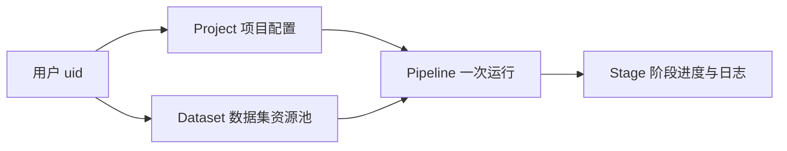
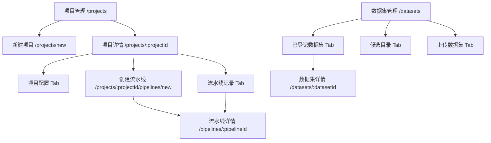
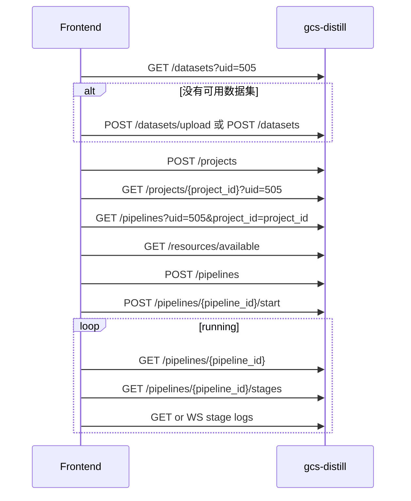

# GCS-Distill 前端页面与跳转说明

本文给前端实现同事使用，重点说明 Project、Dataset、Pipeline 三类对象的页面关系、跳转逻辑和接口调用顺序。

## 1. 核心概念

```text
Project  = 蒸馏项目配置，保存教师模型、学生模型、评估配置和业务场景。
Dataset  = 当前用户可复用的数据集资源，不绑定某个项目。
Pipeline = 一次蒸馏运行，把 project_id + dataset_id + 训练参数 + 资源选择组合起来执行。
```

三者关系：



关键规则：

| 规则 | 说明 |
| --- | --- |
| 所有用户级资源都必须带 `uid` | 后端用 `uid` 派生 `/storage-root-jfs/user-{uid}/train-center/model-distill` |
| Dataset 不带 `project_id` | 数据集是用户级资源池，可被多个项目复用 |
| Pipeline 必须带 `project_id` 和 `dataset_id` | 一次运行必须明确使用哪个项目配置和哪个数据集 |
| `GET /pipelines` 当前按项目查询 | 必须传 `uid + project_id` |
| 前端不直接调用 `gcs-v2` | 只调用 `gcs-distill`，资源与日志由后端代理 |

## 2. 推荐页面结构



推荐主导航：

| 导航 | 页面 | 作用 |
| --- | --- | --- |
| 项目管理 | `/projects` | 创建项目、查看项目、进入项目详情、从项目创建流水线 |
| 数据集管理 | `/datasets` | 上传数据集、登记候选数据集、查看已登记数据集 |
| 流水线详情 | `/pipelines/:pipelineId` | 查看一次运行的状态、阶段、日志和错误 |

不建议单独做一个全局“流水线管理”主页面，因为当前后端的流水线列表接口是项目维度的。如果以后确实需要全局流水线列表，再把 `GET /pipelines` 的 `project_id` 改成可选。

## 3. 项目管理页面

### 3.1 项目列表

页面：`/projects`

接口：

```http
GET /api/v1/projects?uid={uid}&page=1&page_size=10
```

建议展示：

| 字段 | 展示方式 |
| --- | --- |
| `name` | 项目名称 |
| `business_scenario` | 业务场景 |
| `teacher_model_config` | 教师模型摘要 |
| `student_model_config` | 学生模型摘要 |
| `created_at` | 创建时间 |

建议操作：

| 操作 | 跳转或接口 |
| --- | --- |
| 新建项目 | 跳转 `/projects/new` |
| 查看详情 | 跳转 `/projects/:projectId` |
| 创建流水线 | 跳转 `/projects/:projectId/pipelines/new` |
| 删除项目 | `DELETE /api/v1/projects/{project_id}?uid={uid}` |

### 3.2 新建项目

页面：`/projects/new`

需要先拉取本地模型列表：

```http
GET /api/v1/models/teacher
GET /api/v1/models/student
```

提交接口：

```http
POST /api/v1/projects
Content-Type: application/json
```

请求体核心字段：

```json
{
  "uid": 505,
  "name": "客服问答蒸馏",
  "business_scenario": "customer_service",
  "teacher_model_config": {
    "provider_type": "api",
    "model_name": "qwen-max",
    "endpoint": "https://example.com/v1",
    "api_secret_ref": "sk-xxx"
  },
  "student_model_config": {
    "provider_type": "local",
    "model_id": "Qwen2.5-1.5B-Instruct"
  },
  "evaluation_config": {
    "metrics": ["accuracy"],
    "test_set_ratio": 0.1,
    "extra_params": {
      "base_url": "https://example.com/v1",
      "api_key": "sk-xxx"
    }
  }
}
```

前端注意：

| 点 | 说明 |
| --- | --- |
| 教师模型 | 可以是 `api` 或 `local` |
| 学生模型 | 当前建议固定 `local` |
| 本地模型 | 前端提交 `model_id`，后端解析 `model_path` |
| API key | 当前 EasyDistill 运行需要可直接使用的 key 字符串 |

### 3.3 项目详情

页面：`/projects/:projectId`

进入页面时调用：

```http
GET /api/v1/projects/{project_id}?uid={uid}
GET /api/v1/pipelines?uid={uid}&project_id={project_id}&page=1&page_size=10
```

建议分两个 Tab：

| Tab | 内容 |
| --- | --- |
| 项目配置 | 项目名称、业务场景、教师模型、学生模型、评估配置 |
| 流水线记录 | 当前项目下所有 Pipeline 运行记录 |

项目详情页是创建流水线的推荐入口，因为当前项目已经确定，前端不需要再让用户选择 `project_id`。

## 4. 数据集管理页面

页面：`/datasets`

数据集是用户级资源池，不挂在某个项目下面。一个数据集可以被多个项目的流水线复用。

建议分三个 Tab：

| Tab | 作用 | 接口 |
| --- | --- | --- |
| 已登记数据集 | 展示当前用户真正可选择的数据集 | `GET /datasets?uid=...` |
| 候选目录 | 展示服务器 candidates 目录下可登记文件 | `GET /datasets/candidates?uid=...` |
| 上传数据集 | 上传本地文件并自动创建数据集记录 | `POST /datasets/upload` |

### 4.1 已登记数据集

接口：

```http
GET /api/v1/datasets?uid={uid}&page=1&page_size=10
```

返回的数据集包括两类：

| `source_type` | 来源 |
| --- | --- |
| `upload` | 前端上传的新文件 |
| `import` | 从 candidates 目录登记的已有文件 |

建议展示：

| 字段 | 含义 |
| --- | --- |
| `name` | 创建或登记时填写的记录名称 |
| `dataset_name` | 后端从 `file_path` 推导出的真实数据文件名，详情页优先展示 |
| `source_type` | `upload` 或 `import` |
| `record_count` | 数据条数 |
| `file_path` | 真实文件路径，列表中可折叠展示 |
| `created_at` | 创建时间 |

### 4.2 数据集详情

页面：`/datasets/:datasetId`

接口：

```http
GET /api/v1/datasets/{dataset_id}?uid={uid}
```

响应字段与列表 item 一致。详情页标题建议优先使用：

```text
dataset_name || name
```

其中：

| 字段 | 说明 |
| --- | --- |
| `dataset_name` | 真实文件名，例如 `train.jsonl` |
| `name` | 用户填写的展示记录名 |

### 4.3 候选目录登记

候选目录接口：

```http
GET /api/v1/datasets/candidates?uid={uid}
```

候选目录路径：

```text
/storage-root-jfs/user-{uid}/train-center/model-distill/datasets/candidates/
```

用户选择候选文件后，调用登记接口：

```http
POST /api/v1/datasets
Content-Type: application/json
```

请求体：

```json
{
  "uid": 505,
  "name": "客服训练集",
  "description": "从共享候选目录登记",
  "source_type": "import",
  "file_path": "/storage-root-jfs/user-505/train-center/model-distill/datasets/candidates/customer/train.jsonl"
}
```

注意：

| 点 | 说明 |
| --- | --- |
| 这个接口不上传文件 | 只登记 candidates 目录里已经存在的文件 |
| `source_type` 必须是 `import` | JSON 创建接口不允许传 `upload` |
| `file_path` 必须来自 candidates | 后端会校验路径 |

### 4.4 上传数据集

接口：

```http
POST /api/v1/datasets/upload
Content-Type: multipart/form-data
```

表单字段：

| 字段 | 必填 | 说明 |
| --- | --- | --- |
| `uid` | 是 | 当前用户 ID |
| `file` | 是 | 数据集文件 |
| `name` | 否 | 用户填写的记录名称，不填时后端使用文件名 |
| `description` | 否 | 数据集描述 |

后端落盘目录：

```text
/storage-root-jfs/user-{uid}/train-center/model-distill/datasets/uploaded/{dataset_id}/{filename}
```

上传成功后，前端应该刷新：

```http
GET /api/v1/datasets?uid={uid}&page=1&page_size=10
```

不要刷新 `candidates` 来找上传结果。`candidates` 只展示服务器预置候选文件，上传文件会进入 `uploaded/{dataset_id}`。

### 4.5 更新数据集展示信息

接口：

```http
PUT /api/v1/datasets/{dataset_id}
Content-Type: application/json
```

请求体：

```json
{
  "uid": 505,
  "name": "新的记录名称",
  "description": "新的描述"
}
```

只允许更新展示信息。下面字段不会被前端修改：

```text
source_type
file_path
record_count
dataset_name
```

`dataset_name` 始终由后端从 `file_path` 推导。

## 5. 创建流水线页面

推荐入口：项目详情页。

页面：`/projects/:projectId/pipelines/new`

进入页面时已知：

```text
project_id = 当前项目 ID
```

需要调用：

```http
GET /api/v1/projects/{project_id}?uid={uid}
GET /api/v1/datasets?uid={uid}&page=1&page_size=100
GET /api/v1/resources/available
```

页面分区：

| 区块 | 字段 |
| --- | --- |
| 当前项目 | 项目名称、教师模型、学生模型 |
| 选择数据集 | 从已登记数据集列表里选择一个 `dataset_id` |
| 训练参数 | epoch、batch size、learning rate、max length 等 |
| 资源选择 | 节点、卡号、卡数 |
| 提交动作 | 仅创建、创建并启动 |

创建接口：

```http
POST /api/v1/pipelines
Content-Type: application/json
```

请求体：

```json
{
  "uid": 505,
  "project_id": "project-id",
  "dataset_id": "dataset-id",
  "trigger_mode": "manual",
  "training_config": {
    "num_train_epochs": 3,
    "per_device_train_batch_size": 4,
    "gradient_accumulation_steps": 1,
    "learning_rate": 0.00002,
    "weight_decay": 0.01,
    "warmup_ratio": 0.03,
    "lr_scheduler_type": "cosine",
    "save_steps": 100,
    "logging_steps": 10,
    "max_length": 4096
  },
  "resource_request": {
    "gpu_count": 2,
    "selected_resources": [
      {
        "node_name": "gpu-node-01",
        "node_address": "172.18.36.225",
        "xpu_indices": [0, 1]
      }
    ]
  }
}
```

创建成功后只生成 pending 流水线，不会自动启动。

如果用户点击“创建并启动”，再调用：

```http
POST /api/v1/pipelines/{pipeline_id}/start
```

## 6. 项目内流水线列表

建议放在项目详情页的“流水线记录” Tab。

接口：

```http
GET /api/v1/pipelines?uid={uid}&project_id={project_id}&page=1&page_size=10
```

当前后端要求 `project_id` 必填。这个接口不是全局流水线列表。

建议展示：

| 字段 | 显示 |
| --- | --- |
| `id` | 流水线 ID，可缩短展示 |
| `dataset_id` | 绑定的数据集 ID |
| `status` | pending、running、succeeded、failed、canceled |
| `current_stage` | 当前阶段序号 |
| `trigger_mode` | manual |
| `created_at` | 创建时间 |
| `started_at` | 启动时间 |
| `finished_at` | 完成时间 |
| `error_message` | 失败原因 |

列表操作：

| 操作 | 接口或跳转 |
| --- | --- |
| 查看详情 | `/pipelines/:pipelineId` |
| 启动 | `POST /api/v1/pipelines/{pipeline_id}/start` |
| 取消 | `POST /api/v1/pipelines/{pipeline_id}/cancel` |

## 7. 流水线详情和日志

页面：`/pipelines/:pipelineId`

进入页面调用：

```http
GET /api/v1/pipelines/{pipeline_id}
GET /api/v1/pipelines/{pipeline_id}/stages
```

建议 2 到 5 秒轮询一次，直到流水线状态进入：

```text
succeeded
failed
canceled
```

阶段固定为 6 个：

| 顺序 | `stage_type` | 前端展示名 | 是否有容器日志 |
| --- | --- | --- | --- |
| 1 | `teacher_config` | 教师模型配置校验 | 否 |
| 2 | `dataset_build` | 数据集构建 | 否 |
| 3 | `teacher_infer` | 教师推理生成答案 | 是 |
| 4 | `data_govern` | 数据治理/过滤 | 否 |
| 5 | `student_train` | 学生模型训练 | 是 |
| 6 | `evaluate` | 评估 | 是 |

日志接口：

```http
GET /api/v1/pipelines/{pipeline_id}/stages/{stage_id}/logs?tail=100
GET /api/v1/pipelines/{pipeline_id}/stages/{stage_id}/logs/stream?tail=100
GET /api/v1/pipelines/{pipeline_id}/stages/{stage_id}/logs/download?tail=10000
```

WebSocket：

```text
ws://<distill.host>:8080/api/v1/pipelines/{pipeline_id}/stages/{stage_id}/logs/ws?tail=100
```

前端判断：

| 情况 | 展示 |
| --- | --- |
| 阶段没有 `container_id` | 显示“该阶段暂无容器日志” |
| 日志接口返回 404 | 显示“日志尚未准备” |
| WebSocket 断开 | 降级轮询 `/logs?tail=100` |

## 8. 推荐完整用户流程



推荐实际操作顺序：

1. 数据集管理页上传或登记数据集。
2. 项目管理页创建项目。
3. 进入项目详情页。
4. 点击创建流水线。
5. 选择已登记数据集。
6. 填训练参数并选择资源。
7. 创建并启动流水线。
8. 进入流水线详情页查看阶段、日志和结果。

## 9. 前端实现注意事项

| 注意事项 | 说明 |
| --- | --- |
| `uid` 必须贯穿用户级接口 | 不传会返回 400 |
| Dataset 不传 `project_id` | 数据集不是项目私有资源 |
| `GET /pipelines` 必须传 `project_id` | 当前只支持项目内流水线列表 |
| 上传成功后刷新 `GET /datasets` | 不要用 candidates 查上传文件 |
| 创建流水线不等于启动 | 创建后需要再调用 `/start` |
| 日志不是所有阶段都有 | 只有容器阶段通常有日志 |
| `Dataset.dataset_name` 是真实文件名 | 详情页展示数据集名称优先用它 |
| `Dataset.name` 是记录展示名 | 由前端创建或登记时填写 |

## 10. 接口速查

| 页面 | 接口 |
| --- | --- |
| 项目列表 | `GET /api/v1/projects?uid={uid}&page=1&page_size=10` |
| 新建项目 | `POST /api/v1/projects` |
| 项目详情 | `GET /api/v1/projects/{project_id}?uid={uid}` |
| 项目内流水线 | `GET /api/v1/pipelines?uid={uid}&project_id={project_id}&page=1&page_size=10` |
| 已登记数据集 | `GET /api/v1/datasets?uid={uid}&page=1&page_size=10` |
| 数据集详情 | `GET /api/v1/datasets/{dataset_id}?uid={uid}` |
| 候选目录 | `GET /api/v1/datasets/candidates?uid={uid}` |
| 登记候选文件 | `POST /api/v1/datasets` |
| 上传数据集 | `POST /api/v1/datasets/upload` |
| 创建流水线 | `POST /api/v1/pipelines` |
| 启动流水线 | `POST /api/v1/pipelines/{pipeline_id}/start` |
| 流水线详情 | `GET /api/v1/pipelines/{pipeline_id}` |
| 阶段列表 | `GET /api/v1/pipelines/{pipeline_id}/stages` |
| 阶段日志 | `GET /api/v1/pipelines/{pipeline_id}/stages/{stage_id}/logs?tail=100` |

更细的字段定义、后端 handler/service 链路和 EasyDistill 配置映射见：

- [`frontend-integration-handoff.md`](frontend-integration-handoff.md)
- [`frontend-api-backend-map.md`](frontend-api-backend-map.md)
- Swagger UI: `http://<distill.host>:8080/swagger/index.html`
